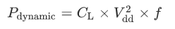

# Computer_Architecture_Lab3
Project for lab 3 of the Advanced Computer Architecture Course.

**Καράμπελας Σάββας, ΑΕΜ: 9005**  
**Καράμπελας Νίκος, ΑΕΜ: 8385**

### ΕΡΩΤΗΜΑ 1

* Dynamic power  

 Από το 2011 μέχρι και σήμερα, το 99% όλων των ολοκληρωμένων κυκλωμάτων κατασκευάζονται
 με τη χρήση τεχνολογίας CMOS. Γίνεται λοιπόν εύκολα αντιληπτή, η σημαντικότητα της δυνατότητας
 μέτρησης, της κατανάλωσης ενέργειας και φυσικά η μελέτη των ενεργειακών απωλειών. Το McPAT μέσω του
 Power Modeling που παρέχει, επιτρέπει την μοντελοποίηση όλων των μορφών power dissipation (dynamic,
 static, short-circuit). Ο όρος dynamic power, χρησιμοποιείται για την περιγραφή της ενέργειας
 που διαχέεται λόγω του switching στα CMOS(γιαυτό πολύ συχνά καλείται και switching energy). Τα κυκλώματα που μελετούμε διαχέουν ενέργεια κατά την φόρτιση και εκφόρτιση των χωρητικών τους φορτίων.  
 Όσο μεγαλύτερη είναι η συχνότητα λειτουργείας του τρανζίστορ,
 η οποία συνήθως αυξάνεται όσο βελτιώνεται και η τεχνολογία που κατασκευάζεται,
 τόσο μεγαλύτερη είναι και η συχνότητα του switching, συνεπώς αυξάνεται το dynamic power dissipation.  

 

 Πρέπει να σημειωθεί ότι είναι απαραίτητο να υπάρχει switching για να υπάρχει dynamic power.
 Ακόμη και αν ένα chip έχει τεράστιο αριθμό χωρητικών στοιχείων CMOS αν δεν υπάρχει εναλλαγή,
 τότε δεν παρατηρείται dynamic power dissipation. Η δυναμική ενέργεια είναι ανάλογη του συνολικού
 χωρικού φορτίου, της τάσης του supply, της συχνότητας του ρολογιού και του voltage swing κατά την εναλλαγή
 κατάστασης.

* Leakage      
Στα κυκλώματα που μελετούμε, τα transistor παρουσιάζουν διαρροές ρευμάτων(static power).
Αυτό το κυκλωματικό φαινόμενο μπορεί να περιοριστεί σε έξι κατηγορίες (Subthreshold Leakage,
  Gate Oxide Tunneling Current, Reverse Biased PN junction Leakage,
Gate Induced Drain Leakage, Hot Carrier Gate Leakage, Punch Through Leakage).
Θα αναλύσουμε τις δύο πιο σημαντικές.
Η πρώτη είναι η διαρροή που παρατηρείται από το terminal της πύλής (gate), το οποίο εξαρτάται
από τον τύπο του τρανζίστορ. Η δεύτερη είναι η διαρροή κατωφλίου (subthreshold leakage)
η οποία παρατηρείται όταν ελάχιστο ρεύμα διαρρέει μεταξύ του source και του drain
terminal ενός ανοιχτοκυκλωμένου, εκείνη τη στιγμή, τρανζίστορ. Συνοψίζοντας, με τον
όρο leakage αναφερόμαστε στις διαρροές ενέργειας όταν το τρανζίστορ είναι σε κατάσταση
αδράνιας.

Η εκτέλεση διαφορετικών προγραμμάτων επηρεάζει μόνο το dynamic power. Ο λόγος που συμβαίνει
αυτό είναι ότι για διαφορετικά προγράμματα διαφοροποιείται και η υλοποίηση του προγράμματος στο
hardware. Θα έχουμε διαφορετικό switching για κάθε διαφορετικό πρόγραμμα. Πέρα από αυτό θα
αλλάξει και η συχνότητα του switching. Κατα συνέπεια θα αλλάξει και το dynamic power. Αντίθετα,
το leakage, είναι ένα συνεχές φαινόμενο το οποίο εξαρτάται από την τεχνολογία. Πιο συγκεκριμένα
το leakage εξαρτάται από τα υλικά και την τεχνολογία κατασκευής του εκάστοτε επεξεργαστή.
Συνεπώς, δεν επηρεάζεται από την διαφοροποίηση του προγράμματος. Ακριβώς με το ίδιο σκεπτικό ένα
πρόγραμμα που διαφέρει από ένα άλλο ως προς τον χρόνο εκτέλεσης, θα έχει διαφορετικό switching
και switching frequency οπότε αλλάζει και το dynamic power. Συγκεκριμένα με βάση την παραπάνω εξίσωση
μεγαλύτερο αν αυξηθεί το switching frequency, κάτι που συμβαίνει σε πιο χρονοβόρα προγράμματα
καθώς, τότε αυξάνεται και το dynamic power.

Στην περίπτωση των δύο επεξεργαστών, όπου ο ένας καταναλώνει 4 Watt και ο άλλος
40 Watt, σε σύστημα που τροφοδοτείται απο μπαταρία συγκεκριμένης χωρητικότητας,
ο πρώτος θα δίνει πάντα μεγαλύτερη διάρκεια μπαταρίας. Όπως φαίνεται στη σχέση του
dynamic power, η ενέργεια είναι ανάλογη της συχνότητας. Για παράδειγμα, διπλασιάζοντας
την συχνότητα διπλασιάζεται και η ενέργεια. Κατά συνέπεια, για υψηλότερα clock speeds
θα έχουμε πάντα μεγαλύτερη κατανάλωση ενέργειας. Καταλαβαίνουμε λοιπόν ότι η ενέργεια
είναι άρρηκτα συνδεδεμένη με την ταχύτητα (και την συχνότητα). Ένας επεξεργαστής 4W
θα δώσει μεγαλύτερη διάρκεια μπαταρίας όμως θα έχει χειρότερη απόδοση.

Το McPAT δε μπορεί να μας δώσει σχετική απάντηση με τα αποτελέσματα που παράγει
