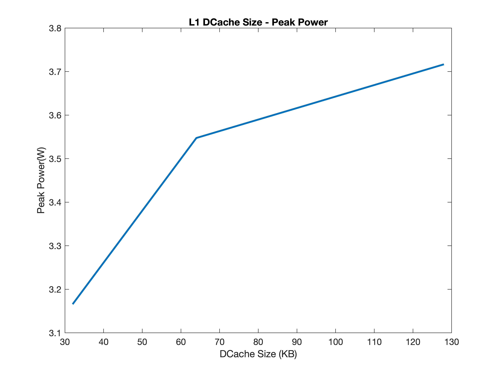
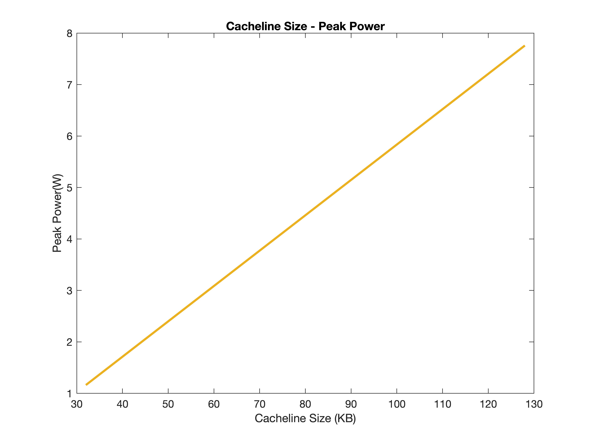
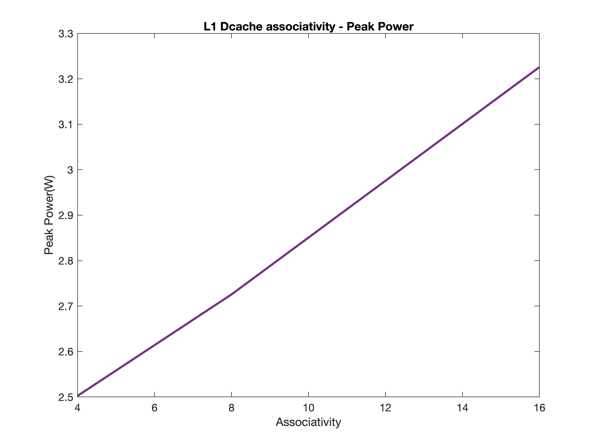
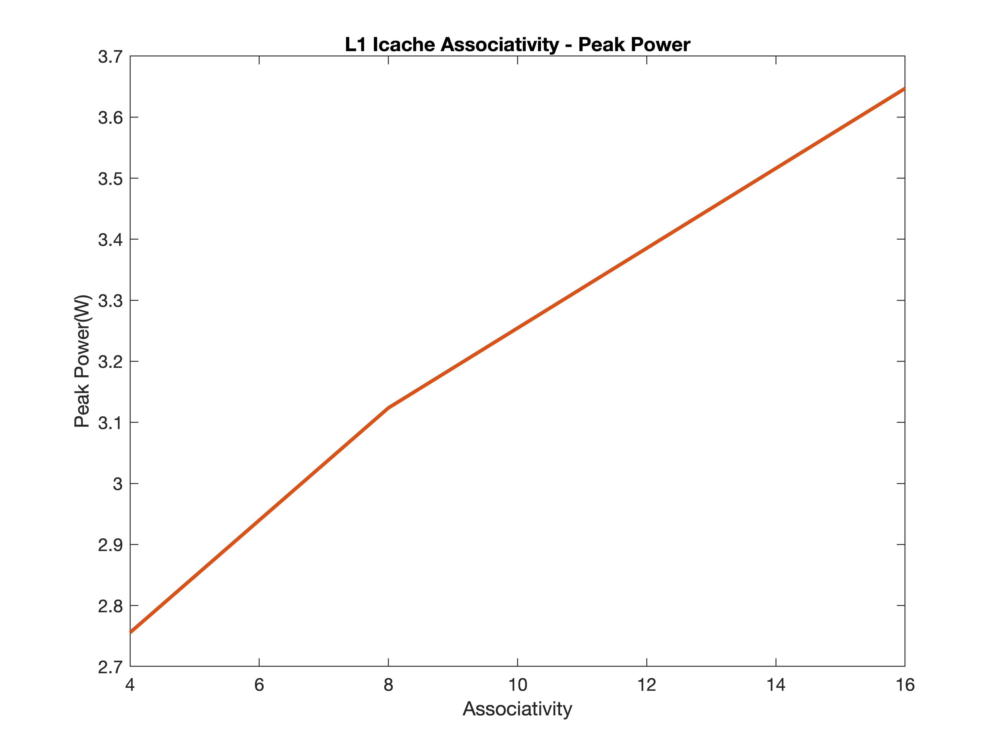
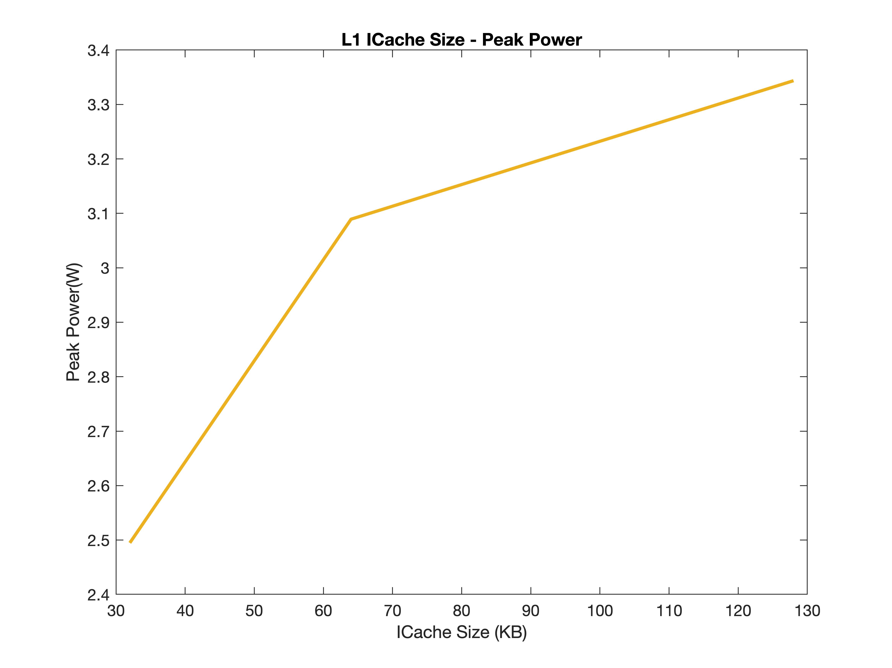
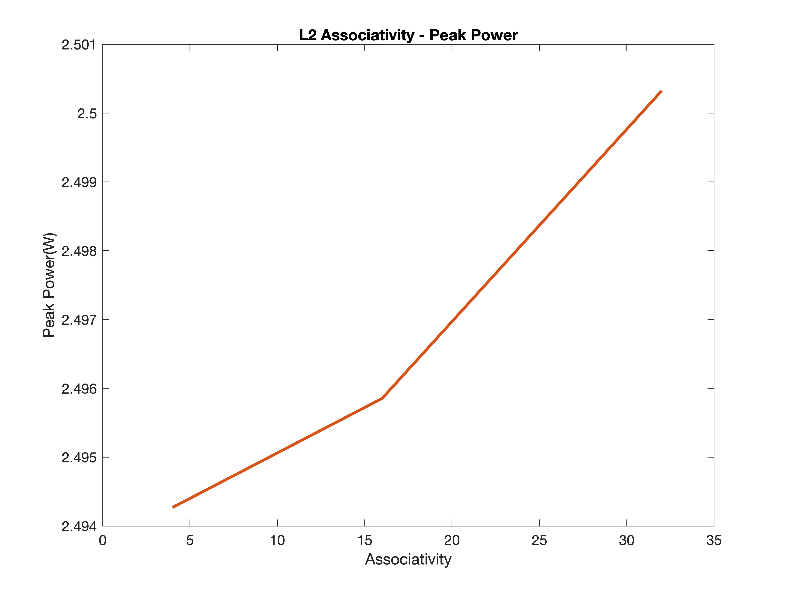
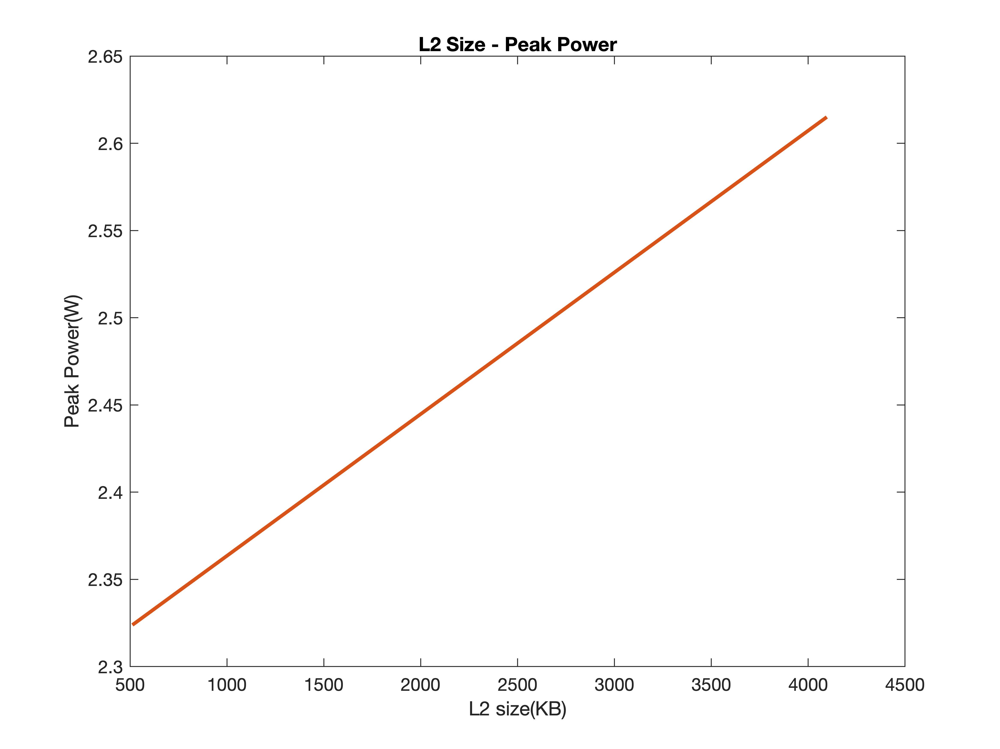

# Εργαστηριακή Άσκηση 3 

**Καράμπελας Σάββας, ΑΕΜ: 9005**  
**Καράμπελας Νίκος, ΑΕΜ: 8385**

## Βήμα 1
### ΕΡΩΤΗΜΑ 1
* Dynamic power  

   Από το 2011 μέχρι και σήμερα, το 99% όλων των ολοκληρωμένων κυκλωμάτων κατασκευάζονται
   με τη χρήση τεχνολογίας CMOS. Γίνεται λοιπόν εύκολα αντιληπτή, η σημαντικότητα της δυνατότητας
   μέτρησης, της κατανάλωσης ενέργειας και φυσικά η μελέτη των ενεργειακών απωλειών. Το McPAT μέσω του
   Power Modeling που παρέχει, επιτρέπει την μοντελοποίηση όλων των μορφών power dissipation (dynamic,
   static, short-circuit). Ο όρος dynamic power, χρησιμοποιείται για την περιγραφή της ενέργειας
   που διαχέεται λόγω του switching στα CMOS(γιαυτό πολύ συχνά καλείται και switching energy). Τα κυκλώματα που μελετούμε διαχέουν ενέργεια κατά    την φόρτιση και εκφόρτιση των χωρητικών τους φορτίων.  
   Όσο μεγαλύτερη είναι η συχνότητα λειτουργείας του τρανζίστορ,
   η οποία συνήθως αυξάνεται όσο βελτιώνεται και η τεχνολογία που κατασκευάζεται,
   τόσο μεγαλύτερη είναι και η συχνότητα του switching, συνεπώς αυξάνεται το dynamic power dissipation.  

   

   Πρέπει να σημειωθεί ότι είναι απαραίτητο να υπάρχει switching για να υπάρχει dynamic power.
   Ακόμη και αν ένα chip έχει τεράστιο αριθμό χωρητικών στοιχείων CMOS αν δεν υπάρχει εναλλαγή,
   τότε δεν παρατηρείται dynamic power dissipation. Η δυναμική ενέργεια είναι ανάλογη του συνολικού
   χωρικού φορτίου, της τάσης του supply, της συχνότητας του ρολογιού και του voltage swing κατά την εναλλαγή
   κατάστασης.  

* Leakage      
Στα κυκλώματα που μελετούμε, τα transistor παρουσιάζουν διαρροές ρευμάτων(static power).
Αυτό το κυκλωματικό φαινόμενο μπορεί να περιοριστεί σε έξι κατηγορίες (Subthreshold Leakage,
  Gate Oxide Tunneling Current, Reverse Biased PN junction Leakage,
Gate Induced Drain Leakage, Hot Carrier Gate Leakage, Punch Through Leakage).
Θα αναλύσουμε τις δύο πιο σημαντικές.
Η πρώτη είναι η διαρροή που παρατηρείται από το terminal της πύλής (gate), το οποίο εξαρτάται
από τον τύπο του τρανζίστορ. Η δεύτερη είναι η διαρροή κατωφλίου (subthreshold leakage)
η οποία παρατηρείται όταν ελάχιστο ρεύμα διαρρέει μεταξύ του source και του drain
terminal ενός ανοιχτοκυκλωμένου, εκείνη τη στιγμή, τρανζίστορ.

    Η εκτέλεση διαφορετικών προγραμμάτων επηρεάζει μόνο το dynamic power. Ο λόγος που συμβαίνει
    αυτό είναι ότι για διαφορετικά προγράμματα διαφοροποιείται και η υλοποίηση του προγράμματος στο
    hardware. Θα έχουμε διαφορετικό switching για κάθε διαφορετικό πρόγραμμα. Πέρα από αυτό θα
    αλλάξει και η συχνότητα του switching. Κατα συνέπεια θα αλλάξει και το dynamic power. Αντίθετα,
    το leakage, είναι ένα συνεχές φαινόμενο το οποίο εξαρτάται από την τεχνολογία. Πιο συγκεκριμένα
    το leakage εξαρτάται από τα υλικά και την τεχνολογία κατασκευής του εκάστοτε επεξεργαστή.
    Συνεπώς, δεν επηρεάζεται από την διαφοροποίηση του προγράμματος. Ακριβώς με το ίδιο σκεπτικό ένα
    πρόγραμμα που διαφέρει από ένα άλλο ως προς τον χρόνο εκτέλεσης, θα έχει διαφορετικό switching
    και switching frequency οπότε αλλάζει και το dynamic power. Συγκεκριμένα με βάση την παραπάνω εξίσωση
    μεγαλύτερο αν αυξηθεί το switching frequency, κάτι που συμβαίνει σε πιο χρονοβόρα προγράμματα
    καθώς, τότε αυξάνεται και το dynamic power.

### ΕΡΩΤΗΜΑ 2

Στην περίπτωση των δύο επεξεργαστών, όπου ο ένας καταναλώνει 4 Watt και ο άλλος
40 Watt, σε σύστημα που τροφοδοτείται απο μπαταρία συγκεκριμένης χωρητικότητας,
ο πρώτος θα δίνει πάντα μεγαλύτερη διάρκεια μπαταρίας. Όπως φαίνεται στη σχέση του
dynamic power, η ενέργεια είναι ανάλογη της συχνότητας. Για παράδειγμα, διπλασιάζοντας
την συχνότητα διπλασιάζεται και η ενέργεια. Κατά συνέπεια, για υψηλότερα clock speeds
θα έχουμε πάντα μεγαλύτερη κατανάλωση ενέργειας. Καταλαβαίνουμε λοιπόν ότι η ενέργεια
είναι άρρηκτα συνδεδεμένη με την ταχύτητα (και την συχνότητα). Ένας επεξεργαστής 4W
θα δώσει μεγαλύτερη διάρκεια μπαταρίας όμως θα έχει χειρότερη απόδοση. Το McPAT δε
μπορεί να μας δώσει σχετική απάντηση με τα αποτελέσματα που παράγει γιατί δε παρέχει
καμία πληροφορία για τον χρόνο και την ταχύτητα εκτέλεσης, στοιχεία απαραίτητα για
υπολογισμούς που περιλαμβάνουν την ενέργεια. Για αυτό τον λογο χρησιμοποιούμε
τον **συνδιασμό gem5 και McPAT** στο συγκεκριμένο εργαστήριο.  

### ΕΡΩΤΗΜΑ 3

| CORE | XEON  | A9  |
|---|---|---|
|CLOCK RATE | 3400  |  2000 |
|TECHNOLOGY | 65nm  | 40nm |
|TOTAL LEAKAGE |  36.8319 W |  0.108687 W |
|PEAK POWER  |  134.938 W | 1.74189 W  |
|PEAK DYNAMIC  | 98.1063 W   |  1.6332 W |
|AREA   |  410.507 mm^2 |  5.39698 mm^2 |

Υποθέτουμε ότι ο Xeon τρέχει την ίδια εφαρμογή 40 φορές γρηγορότερα από τον Α9.
Παρόλαυτα όπως φαίνεται από τον παραπάνω πίνακα το Peak Power του Xeon είναι πολύ
μεγαλύτερο από αυτό του A9. Για την ακρίβεια ακόμα και αν πολλαπλασιάζαμε το PEAK
POWER του Α9 με το 40, το αποτέλεσμα θα ήταν 69.6756 Watt. Σαφώς μικρότερο από το PEAK
POWER του Xeon (134.938 W). Επίσης παρατηρούμε πως το clockrate του Xeon είναι μεγαλύτερο
από του Α9. Κρίνοντας λοιπόν την ενεργειακή απόδοση, παρατηρούμε ότι οι απώλειες στον
Xeon είναι πολύ μεγαλύτερες. Το γεγονός αυτό είναι ανεξάρτητο της ταχύτητας. Μας ενδιαφέρει
μόνο το ποσοστό της ενέργειας που δαπανάται ποιοτικά.

## Βήμα 2  
  
### ΕΡΩΤΗΜΑΤΑ 1 & 2
   
 
 
 
 
 
 

 
Εν τέλει καταλήξαμε στο ότι το ιδανικό μοντέλο είναι το παρακάτω:  

* L1 Icache size: 32kB
* L1 Icache associativity: 2
* L1 Dcache size: 32kB
* L1 Dcache associativity:2
* L2 cache size: 512
* L2 cache associativity:16
* Cache line size: 64kB  

Οι προσομειώσεις μικροαρχιτεκτονικών στο McPAT δεν δίνουν πάντα ακριβή/σωστά αποτελέσματα.

* Διαφορετική Υλοποίηση και Μοντελοποίηση  
Στην περίπτωση που το η μικροαρχιτεκτονική που μοντελοποιούμε στο McPAT, δεν είναι
ακριβώς ίδια/παρουσιάζει διαφορές με την πραγματική υλοποίηση της CPU.

* Λανθασμένα ή Ημιτελή Μοντέλα  
Στην περίπτωση που λείπουν σημαντικά δομικά στοιχεία της μικροαρχιτεκτονικής. Αυτή
η περίπτωση αφορά abstraction errors. Παρατηρείται όταν χρησιμοποιείται ένα subset
του γενικού μοντέλου αλλά όχι ολόκληρο θεωρώντας ότι επαγωγικά τα αποτελέσματα θα είναι
τα ίδια. Επίσης υπάρχει και η περίπτωση όπου η μοντελοποίηση γίνεται με βάση high-level
abstractions αγνοώντας τις low level υλοποιήσεις. Μία αναλογία αυτού, είναι η προσπάθεια
να μελετήσουμε την ενεργειακή απόδοση μίας αρχιτεκτονικής χρησιμοποιώντας μόνο τον ISA
και όχι την πραγματική υλοποίηση του Hardware.

>### Αξιολόγηση Εργασίας  

Δυσκολία:      
Η εργασία ενδέχεται να παρουσιάσει διαφορετική δυσκολία για τον φοιτητή, ανάλογα
με την προσέγγιση του. Πιο συγκεκριμένα, η δυσκολία έγκειται τόσο στην κατανόηση
εννοιών οι οποίες χρησιμοποιούνται σε όλα τα στάδια της εργασίας, όσο και στην 
πρακτική υλοποίηση. Χωρίς scripts αυτοματοποίησης του δεύτερου κομματιού η εργασία 
γίνεται πολύ χρονοβόρα. Αντίστοιχα, με το δεύτερο εργαστήριο, το τρίτο απαιτεί
πολλά tests. Παρόλαυτα αν ο φοιτητής αφιερώσει λίγο 
χρόνο στο αυτοματοποιήσει τα tests και ασχοληθεί με την ουσία, που είναι να 
αντιληφθεί τις διαρροές ενέργειας και την ενεργειακή απόδοση στη CPU, η δουλειά 
του γίνεται σαφώς πιο ευχάριστη.

Νέες Γνώσεις:     
Σε αυτό το εργαστήριο μάθαμε να χρησιμοποιούμε το McPAT και αντιληφθήκαμε πώς θα
χρησιμοποιούμε το συγκεκριμένο emulator σε συνδιασμό με τον gem5 για να μπορούμε 
να φτιάχνουμε συνολικά πιο ολοκληρωμένες προσομοιώσεις για την ανάλυση τόσο της 
ταχύτητας, των επιδράσεων που έχουν αλλαγές της μικροαρχιτεκτονικής στο κόστος 
και πλέον με τη χρήση του McPAT και την ενεργειακή απόδοση. 

Περιττές Δυσκολίες:   

### ΠΗΓΕΣ  

* [McPAT An Integrated Power, Area, and Timing Modeling Framework for Multicore and Manycore Architectures](https://www.hpl.hp.com/research/mcpat/micro09.pdf)
* [McPAT An Integrated Power, Area, and Timing Modeling Framework for Multicore Architectures](https://www.hpl.hp.com/research/mcpat/McPATAlpha_TechRep.pdf)
* [CMOS Power Dissipation and Trend, University of California](https://www.ece.ucdavis.edu/~ramirtha/EEC216/W08/lecture1_updated.pdf)
* [A Static Power Model for Architects, J. Adam Butts and Gurindar S. Sohi](http://pages.cs.wisc.edu/~butts/micro00.pdf)
* [Quantifying sources of error in McPAT and potential impacts on architectural studies](https://ieeexplore.ieee.org/document/7056064)
* Computer Architecture: A Quantitative Approach, Patterson, Hennessy
* [University of Pennsylvania - Computer Architecture](https://www.cis.upenn.edu/~milom/cis501-Fall10/lectures/12_power.pdf)
* [Stanford University - Computer Architecture](https://web.stanford.edu/class/archive/ee/ee371/ee371.1066/lectures/Old/Older/lect_11_low_power_2up.pdf)
